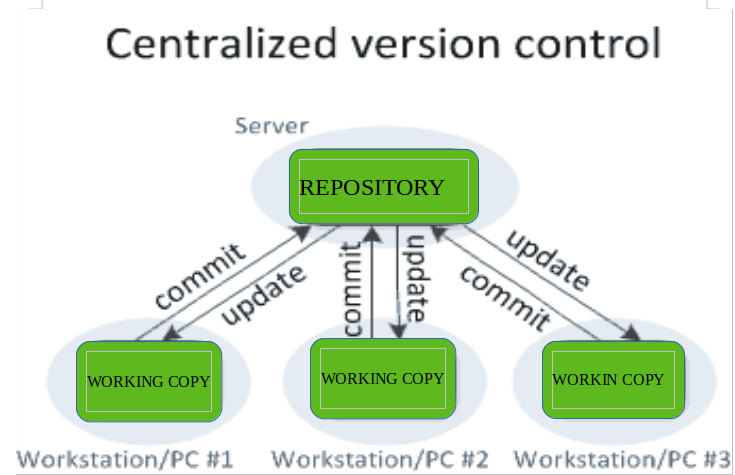

Git and basics of VCS
A VCS or Version Control System is a way of managing, keeping track of a large codebase or a collection of files allowing multiple developers, managers and other people to work on the same project.

Centralized Version Control System
Earlier in the older legacy systems, a centralized VCS was used, in which the developers all had to work on a single shared repository, which even caused a lot of issues as there were no chances of parallel development.

Centralized VCS
Some common examples are:

Subversion
Perforce
Distributed Version Control System
In the past few years, developers and project managers have moved to a more de-centralized or distributed version control system. These systems do not rely solely on a centralized server to store all the project files. Instead, every developer now has a complete clone of the project files and has the history of almost all the changes and commits made during the development of the project on their local machines.

Distributed VCS
Distributed version control systems contain multiple repositories. Each user has their own repository and working copy. Just committing your changes will not give others access to your changes. This is because commit will reflect those changes in your local repository and you need to push them in order to make them visible on the central repository. Similarly, When you update, you do not get others’ changes unless you have first pulled those changes into your repository. 

Some common examples are:

Git
Mercurial
Getting Started with Git:
To get started with git, firstly install git from: git-scm

After installing git, let us start by cross-checking if git is installed.

To check if git is installed run the following command in your terminal:

git --version
Now if you have git installed, let's go over some basic git commands:

init: The git init command is used to initialise a git repository in the present directory.

git init
This will create a git repository in your current directory.

add: The add command is used to add the changes made in the code and move it to the staging/tracking area of git. If you do not use add command, the changes you have made will be untracked.

 git add -A
 # or specify file name
 git add <filename>
The add command has multiple ways of adding a file. You can use the "-A" to add all the files that have changes or you can specify a single file you wish to.

commit: The git commit command is used to create a timestamp of our original codebase, this timestamp is useful for keeping track of the progress of the application and also reverting back incase of any errors.

# To make a commit.
git commit -m "a meaningful commit message"
The HEAD will now point to the commit_id generated by this command.

push: The git push command is used to move the changes to the remote/central repository.

git push <remote-repo-alias> <branchname>
